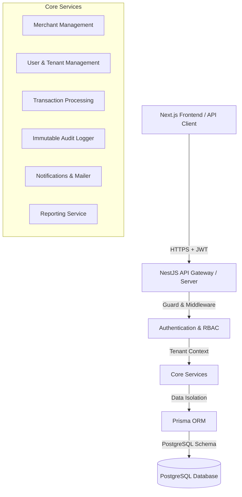
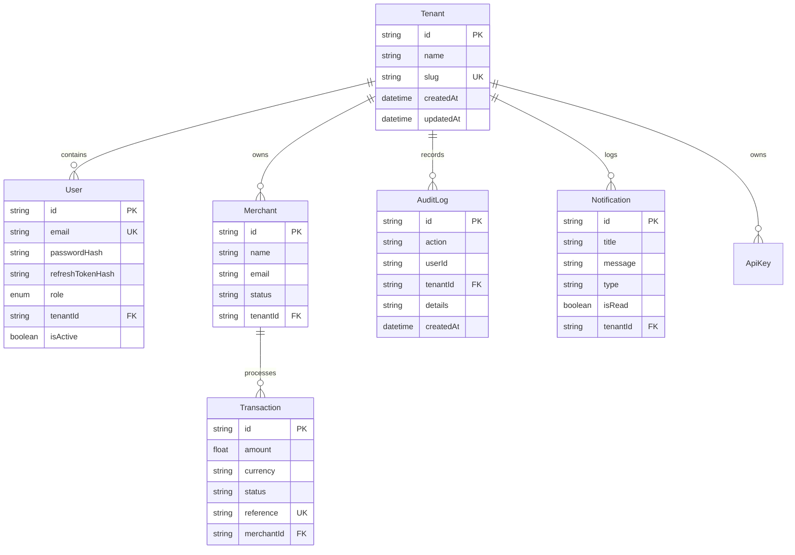

# Multi-Tenant Payment Platform Architecture & System Design

## 1. System Architecture Overview

---

## 2. Multi-Tenant Data Isolation Strategy

- **Logical Data Isolation**: Every entity (`User`, `Merchant`, `Transaction`, `AuditLog`, `Notification`, `ApiKey`) contains a non-nullable `tenantId`.
- **JWT Context Enforcement**: JWT tokens embed `tenantId` and `role`. 
- **RBAC Roles Hierarchy**:
  1. `SUPER_ADMIN` (Cross-tenant access for system management)
  2. `TENANT_ADMIN` (Full administrative privileges within tenant workspace)
  3. `MANAGER` (Transaction management and reporting access)
  4. `OPERATOR` (Transaction creation and basic operational access)
  5. `VIEWER` (Read-only access to dashboard and logs)

---

## 3. Database Entity Relationship Diagram (ERD)

